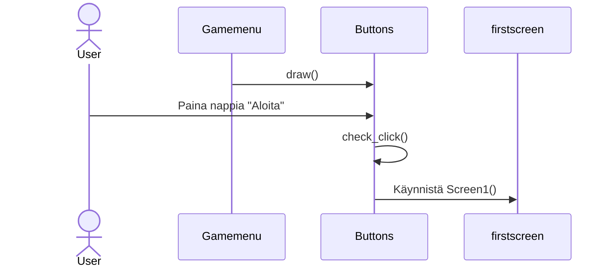
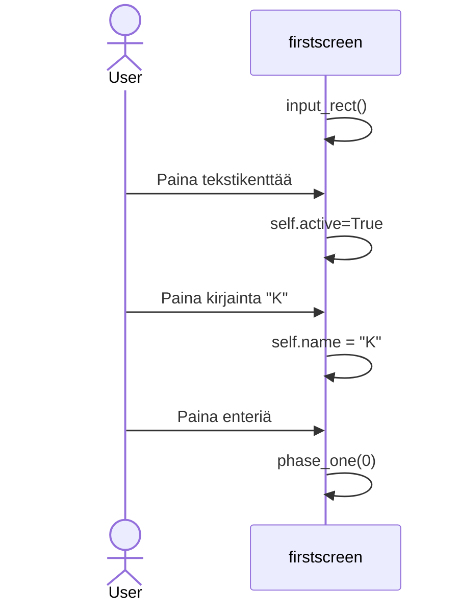

# Arkkitehtuurikuvaus

## Rakenne
main.py käynnistää sovelluksen kutsumalla gamemenu.py:tä, ajatuksena, että muokkaan sitä niin, että se käynnistää kaikki ruudut, eikä niin että gamemenu.py käynnistää firstscreenin (koska tästä voi aiheutua ongelmia myöhemmin, jos peli mahdollistaa siirtymisen aiempaan ruutuun). Jokaiselle ruudulle on omat sovelluslogiikkaan liittyvät tiedostot, joita vain kyseiseen ruutuun liittyvä luokka voi kutsua.
## Käyttöliittymä
Käyttöliitymässä on tällä hetkellä kaksi eri ruutua:

- Aloitusvalikko
- Pääpeli (Pääpeli saatetaan jaotella myöhemmin vielä useampaan ruutuun)

Tällä hetkellä sovelluslogiikasta ainoastaan nappulat ovat erillisessä tiedostossa, tosin paljon siitäkin liittyy käyttöliittymään

Sovellus on hyvin käyttöliittymäkeskeinen, joten sovelluslogiikkaa ei ole ainakaan tällä hetkellä eristetty käyttöliittymästä. Sen sijaan eri toiminnallisuudet on eristetty omiin kansioihin.
## Sovelluslogiikka
Pullojen klikkaaminen nostaa rahamäärää

## Tietojen pysyväistallennus
- Tälläistä ominaisuutta ei vielä ole
### Tiedostot

## Päätoiminnallisuudet
- Käynnistä peli aloitusvalikosta

- Kirjoita nimi tekstikenttään ja palauta nimi ja lisää tekstiä painamalla enteriä

## Ohjelman rakenteeseen jääneet heikkoudet
- Testejä ei ole vielä tarpeeksi
- Käyttöliittymän ulkonäkö kaipaa hienosäätöä
- Ominaisuudet ovat vielä vajavaiset
- (Lisää juttua arkkitehtuuritiedostoon)
