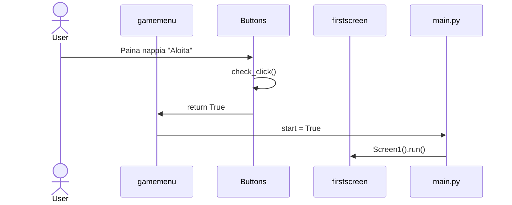
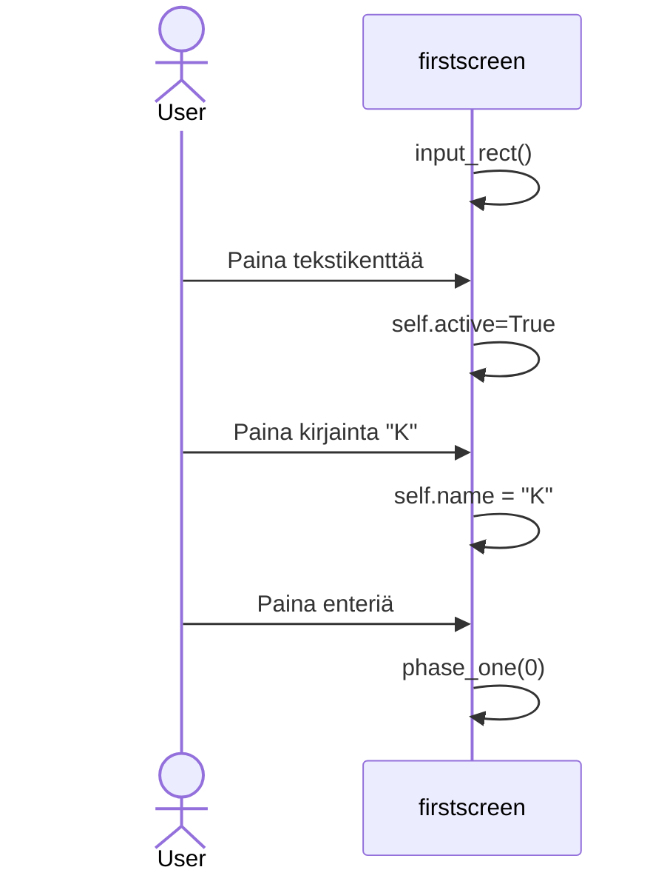
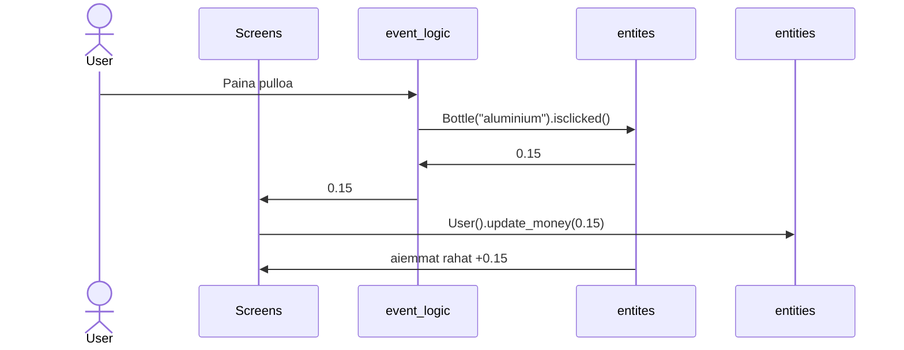

# Arkkitehtuurikuvaus

## Rakenne

- Screens sisältää nimensä mukaisesti näytöt ja kutsuu niiden liittyviä logiikoita
- Buttons kansio sisältää nappulat
- event_logic sisältää monimutkaisemmat pelilogiikat eli minipelit yms.
- static alakansiot sisältävät yläkansioon liittyvää grafiikkaa
- texts kansio sisältää ainoastaan ruudulle tulostettavaa tekstiä, koska tämä veisi muuten paljon tilaa riveiltä, josta pylint ei tykkää (voisi toki olla myös draw kansion alakansio)
- entities sisältää tietoa "olennoista" (tällä hetkellä pullosta ja käyttäjästä), jotka on eristetty pygame/käyttöliittymä asioista
- draw kansiossa on komennot jotka piirtävät kaikki kuvat ja tekstit joihon ei liity mitään logiikkaa (esim. niitä ei voi klikata)
## Käyttöliittymä
Käyttöliitymässä on tällä hetkellä kaksi eri ruutua:

- Aloitusvalikko
- Pääpeli (Pääpeli saatetaan jaotella myöhemmin vielä useampaan ruutuun)

Sovellus on hyvin käyttöliittymäkeskeinen, joten tein pakkausrakenteesta erilaisen kuin mallisovelluksessa.
## Sovelluslogiikka
-raha

## Tietojen pysyväistallennus
- Käyttäjän tiedot (nimi ja rahat) tallennetaan entities kansiossa olevaan users.py tiedostoon
### Tiedostot

## Päätoiminnallisuudet
- Käynnistä peli aloitusvalikosta

- Kirjoita nimi tekstikenttään ja palauta nimi ja lisää tekstiä painamalla enteriä

Kerää pullo (Todo)

## Ohjelman rakenteeseen jääneet heikkoudet
- Testejä ei ole vielä tarpeeksi
- Käyttöliittymän ulkonäkö kaipaa hienosäätöä
- Ominaisuudet ovat vielä vajavaiset
- (Lisää juttua arkkitehtuuritiedostoon)
