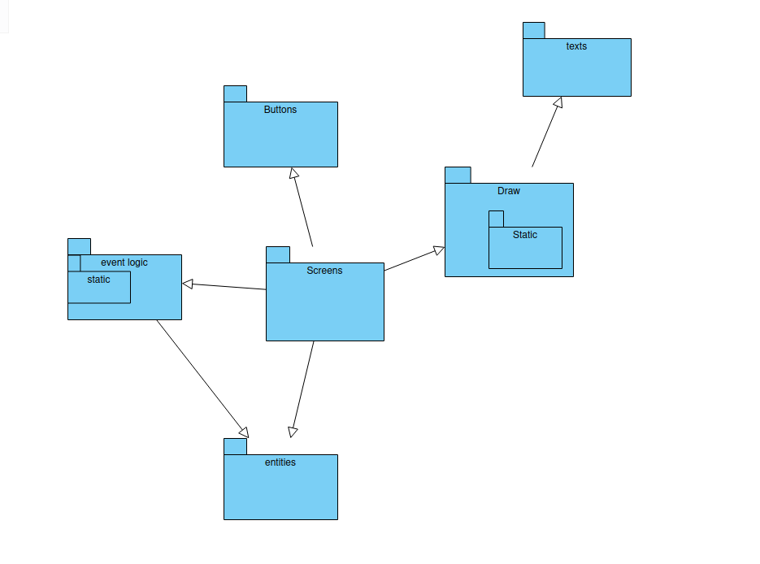
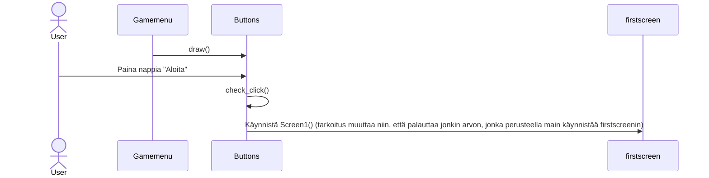
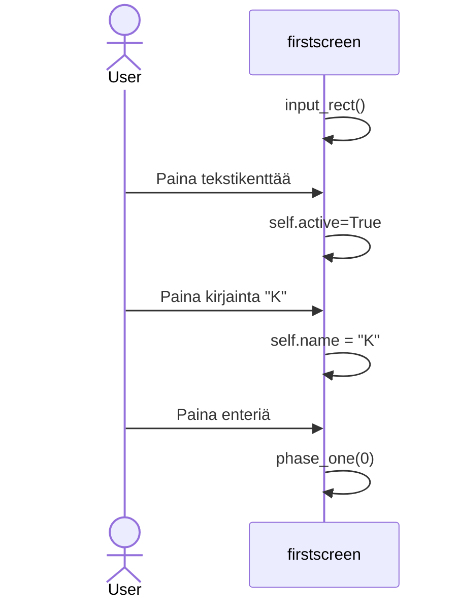
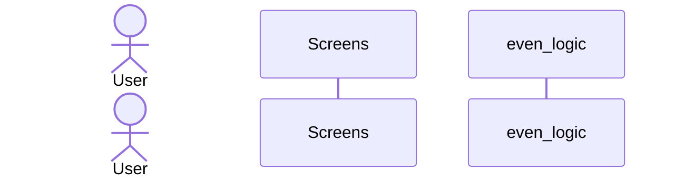

# Arkkitehtuurikuvaus

## Rakenne

- Screens sisältää nimensä mukaisesti näytöt ja kutsuu niiden liittyviä logiikoita
- Buttons sisältää nappulat (mahdollisesti liitetään myöhemmin event_logic kansion alakansioksi
- event_logic sisältää monimutkaisemmat pelilogiikat (peliin liittyvät minipelit)
- static kansio sisältää pelin grafiikat
## Käyttöliittymä
Käyttöliitymässä on tällä hetkellä kaksi eri ruutua:

- Aloitusvalikko
- Pääpeli (Pääpeli saatetaan jaotella myöhemmin vielä useampaan ruutuun)

Tällä hetkellä sovelluslogiikasta ainoastaan nappulat ovat erillisessä tiedostossa, tosin paljon siitäkin liittyy käyttöliittymään

Sovellus on hyvin käyttöliittymäkeskeinen, joten sovelluslogiikkaa ei ole ainakaan tällä hetkellä eristetty käyttöliittymästä. Sen sijaan eri toiminnallisuudet on eristetty omiin kansioihin.
## Sovelluslogiikka
Pullojen klikkaaminen nostaa rahamäärää

## Tietojen pysyväistallennus
- Tälläistä ominaisuutta ei vielä ole
### Tiedostot

## Päätoiminnallisuudet
- Käynnistä peli aloitusvalikosta

- Kirjoita nimi tekstikenttään ja palauta nimi ja lisää tekstiä painamalla enteriä

Kerää pullo (Todo)

## Ohjelman rakenteeseen jääneet heikkoudet
- Testejä ei ole vielä tarpeeksi
- Käyttöliittymän ulkonäkö kaipaa hienosäätöä
- Ominaisuudet ovat vielä vajavaiset
- (Lisää juttua arkkitehtuuritiedostoon)
